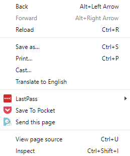
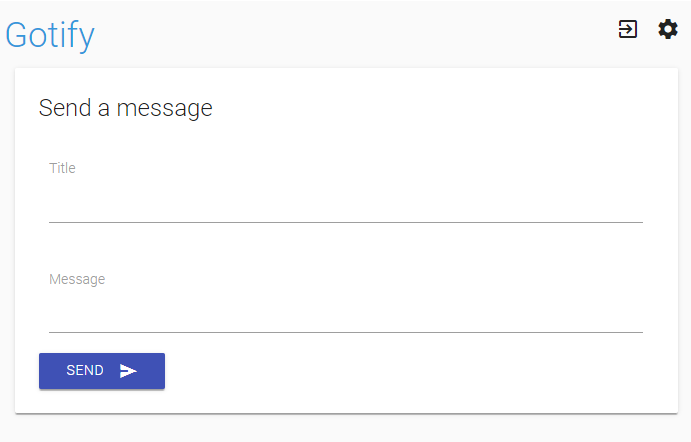
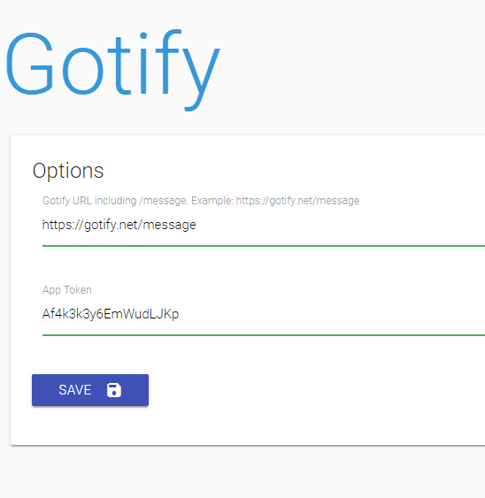

Gotify Chrome Extension
===========

[Gotify](https://gotify.net)

Gotify Chrome is a Chrome extension for sending push notifications to your Gotify server.

You can push the current page's URL or create a note and send it via the shortcut in the top corner.

**Right-click menu**

**Shortcut popup**

On your Gotify server, create a new Application and name it something like `Chrome`. Then, in the Gotify Chrome settings page, enter in your server address and app key.

